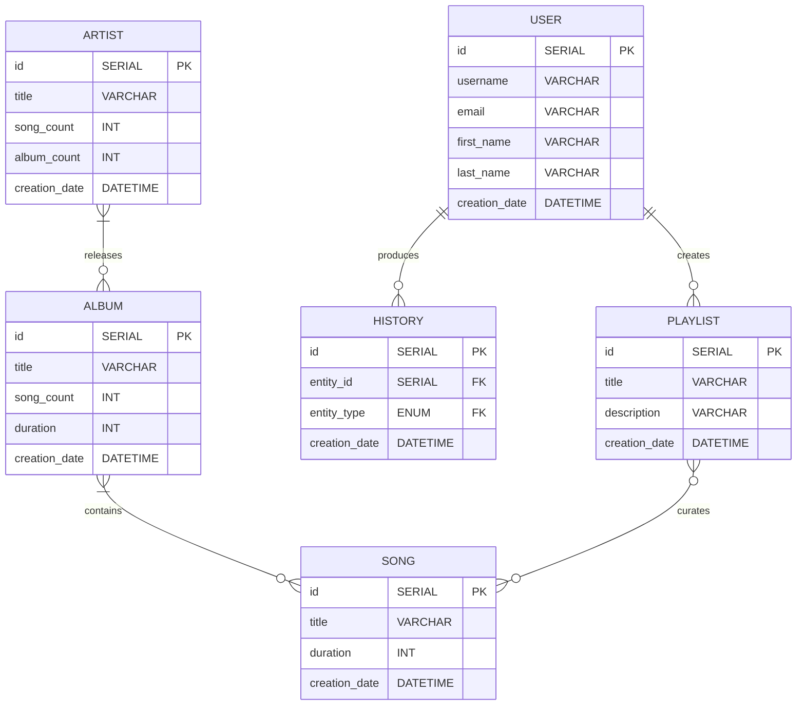

```mermaid
erDiagram
    USER
    PLAYLIST
    HISTORY
    SONG
    ALBUM
    ARTIST

    USER ||--o{ PLAYLIST : creates
    USER ||--o{ HISTORY : produces


    ARTIST }|--o{ ALBUM : releases
    ALBUM }|--o{ SONG : contains
    PLAYLIST }o--o{ SONG : curates

    USER {
        id SERIAL PK
        username VARCHAR
        email VARCHAR
        first_name VARCHAR
        last_name VARCHAR
        creation_date DATETIME
    }

    SONG {
        id SERIAL PK
        title VARCHAR
        duration INT
        creation_date DATETIME
    }

    PLAYLIST {
        id SERIAL PK
        title VARCHAR
        description VARCHAR
        creation_date DATETIME
    }

    ALBUM {
        id SERIAL PK
        title VARCHAR
        song_count INT
        duration INT
        creation_date DATETIME
    }

    ARTIST {
        id SERIAL PK
        title VARCHAR
        song_count INT
        album_count INT
        creation_date DATETIME
    }

    HISTORY {
        id SERIAL PK
        entity_id SERIAL FK
        entity_type ENUM FK
        creation_date DATETIME
    }
```
